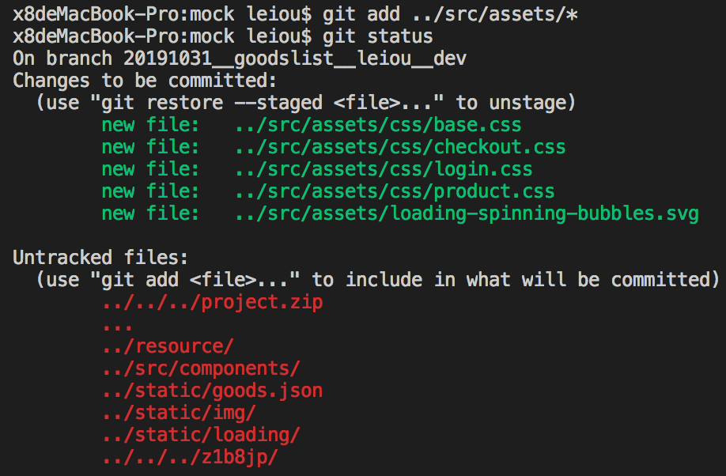

1. 在使用Github的时候会遇到一些奇怪的问题，这次就是在项目目录下新增了许多文件夹以及文件，在使用git add . 命令的时候并不能把文件变动提交修改成功，继续commit 的话就会提示以下错误，大意是以下文件未被追踪：

    

    遇到这样的问题也好解决，前提是新变动或者说新增的文件比较少只有几个那样。但是当前所遇到的情况是最少都有几十上百个新文件，如果每一文件都要使用git add fileName这种方法去加入跟踪的话，估计是要崩溃。不过还好，这种情况肯定不止我一个人遇到的，所以GitHub的开发者们肯定不会用这么蠢的方式。想到*在很多情况下都用通配符的作用，就想会不会也可以与add命令搭配使用呢，一试果然有惊喜：

    

    然后这个问题就这样解决了，但是又有一个问题，为什么新增了文件之后git不会自动追踪而要手动操作一遍呢？有待探讨。

2. pull 和 fetch 的区别

