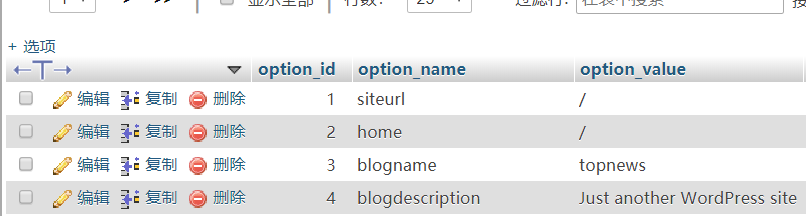

1. 忘记密码，通过修改数据库重设密码

    登录phpMyadmin ，进入到网站对应的数据库，如：wordpressdb，然后找到并打开 wp_users 那个表。把user_pass的值编辑为`5d41402abc4b2a76b9719d911017c592`===>`hello`（Md5编码）。保存后用hello作为密码登录，成功进入wordpress后台再更新密码即可。


2. 自动显示封面图

    遇到这个问题，首先肯定是去Google上搜一下，找到一些别人分享的方法，有现成的代码可以用，复制到functions.php文件下。满怀希望去刷新页面，结果没有效，这类型的代码又试了另外一个，结果同样是不行。

    **类似这种：**
    ```
    function autoset_featured() {
          global $post;
          $already_has_thumb = has_post_thumbnail($post->ID);
              if (!$already_has_thumb)  {
              $attached_image = get_children( "post_parent=$post->ID&post_type=attachment&post_mime_type=image&numberposts=1" );
                          if ($attached_image) {
                                foreach ($attached_image as $attachment_id => $attachment) {
                                set_post_thumbnail($post->ID, $attachment_id);
                                }
                           }
                        }
    }  //end function
    add_action('the_post', 'autoset_featured');
    add_action('save_post', 'autoset_featured');
    add_action('draft_to_publish', 'autoset_featured');
    add_action('new_to_publish', 'autoset_featured');
    add_action('pending_to_publish', 'autoset_featured');
    add_action('future_to_publish', 'autoset_featured');

    ```
    再找别的方法，在一篇文章中看到推荐一个插件：[**Set All First Images As Featured**](https://wordpress.org/plugins/set-all-first-images-as-featured/)。下载下来，解压、复制到plugins目录下，回到wordpress控制台刷新安装此插件，运行一下，运行结果提示异常。

    刷新页面一看，封面图区域出来了，但是图片没有显示。用浏览器检查页面，发现图片的路径是默认的上传路径。但是图片并不是放在那个目录，所以去数据库控制台修改wp_options表中upload-path的值为图片目录，刷新页面。这是发现图片有了，可是图片尺寸是1*1的，控制台修改样式`width:100%`，这时图片正常显示了。

    到这里遇到的问题是图片已经成功加载出来，但是显示为1*1的大小，需要想办法把样式改为显示正常图片大小。第一时间想到的是直接去php的代码中修改生成封面图的代码，一不小心就走入了坑里面，定位到content.php文件下的一个函数the_post_thumbnail，Google了一下。
    ```php
    #用法: 
    <?php the_post_thumbnail( $size, $attr );>
    
    #参数:
    $size
    (string/array) (Optional) 图片大小，可以是以下几个关键字：thumbnail, medium, large, full，或者通过函数 add_image_size() 自定义尺寸的关键字。或者宽和高的一个大小，比如：(32,32).

    $attr
    (array) (Optional) 属性/值的一个数组，the_post_thumbnail 传递给函数 wp_get_attachment_image用来获取图。

    ```
    
    折腾了好一段时间，还是没有成功，不过可以确认的是关键代码的确是这里。改变思路，既然用函数生成的代码改不了，不如直接去修改样式文件？把样式文件`style.css`修改完，覆盖旧文件刷新页面，终于正常显示了。


3. 手动替换wordpress版本

    - 备份网站文件以及数据库，把所有在运行的插件全部停止
    - 下载需要替换的wordpress版本，解压并删除wp-content目录
    - 用命令`/bin/cp -rf /path/wordpress/* ./`复制并覆盖服务器上wordpress目录下的文件
    - 刷新网站页面或浏览器输入`http://youdomain.com/wp-admin/upgrade.php`确认升级
    - 重新打开需要的插件，备份数据


4. 添加语言包

    - [语言包导出](https://translate.wordpress.org/projects/wp/4.8.x/en-gb/default/)
    - [语言代码对照](https://make.wordpress.org/polyglots/teams/)


5. nginx服务器wordpress后台设置固定链后返回404

    ```php
    // 编辑文件：vi /usr/local/nginx/conf/nginx.conf（不同环境或版本该路径可能有所不同）
    # 在server代码块中加入以下部分代码
     location / {
         index index.html index.php;
         if (-f $request_filename/index.html){
             rewrite (.*) $1/index.html break;
         }
         if (-f $request_filename/index.php){
             rewrite (.*) $1/index.php;
         }
         if (!-f $request_filename){
             rewrite (.*) /index.php;
         }
     }
     rewrite /wp-admin$ $scheme://$host$uri/ permanent;

    ```

6. wordpress配置全局相对路径

    - 数据库后台设置
    1. 登录数据库后台
    2. 打开wordpressdb数据库
    3. 找到wp_options数据表并点击进去,编辑siteurl和home两个选项的option_value为【/】，如图：
    
    **注意：** 编辑完成后记得点执行按钮。


    - wp-config.php 文件配置

    1. 进入到网站根目录
    2. vi wp-config.php （编辑配置文件）
    3. 在最底下添加以下代码：
    ```php
      $home = '/';
      $siteurl = '/';

      define('WP_HOME', $home);
      define('WP_SITEURL', $siteurl);
    ```


7. 给网站引流

    关键在于：如何吸引他人的注意、能为他人提供何种价值、如何自然地植入。

    其他用户首先看到的是标题，有个有趣而吸引人的标题就相当于成功了一半；还有另一半同样重要的是内容。内容应该要追求：比我惨、与我类似、能学到东西，围绕这几个核心出发点去产出内容。

    - 投机取巧

    1. 假如发主题或回复主题可以嵌入图片，且图片可以添加外部链接。这种情况就可以选用一张有吸引力的图片放上去，并且给图片加入链接，还有关键一点就是把图片的尺寸缩小（需要论坛支持），大概是100x100左右。根据用户习惯，访客浏览帖子过程中注意到图片一般会点击查看大图，一点击自然就会把用户导航到目标链接的页面上。


    - 论坛
  
        常用方法：

        - 发帖
        - 回帖
        - 签名
        - 站内信息
  
        可能会面临的问题：

       1. 短期内没有关注
       2. 被管理员删帖
       3. 不能保持帖子热度 

    - 社区群组


    - 问答社区


