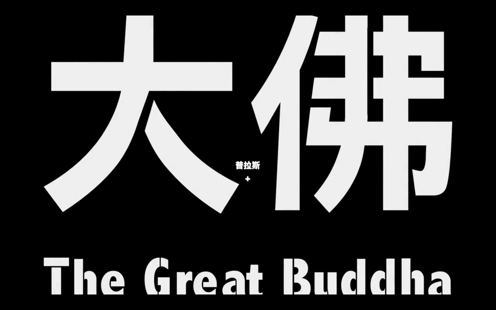
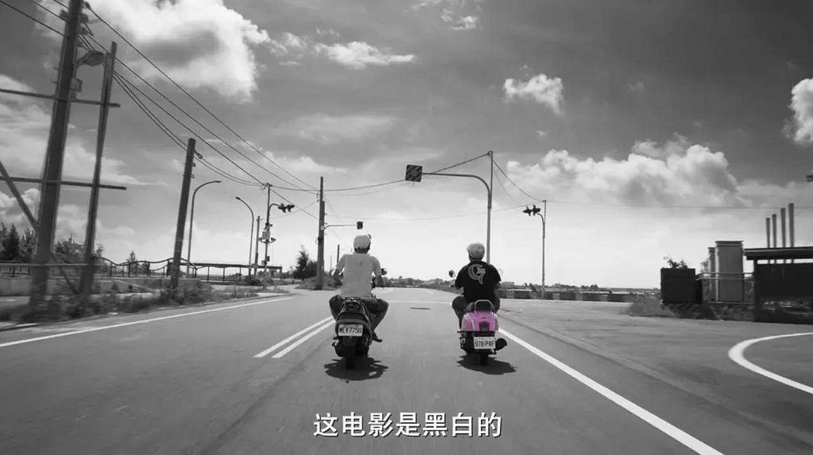
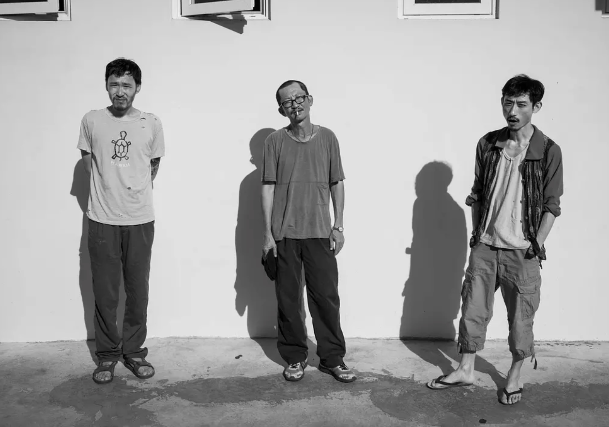
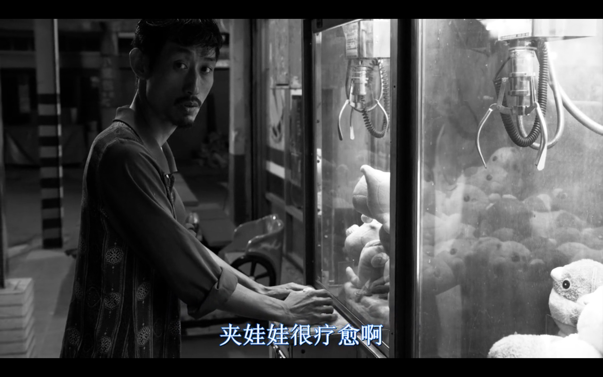
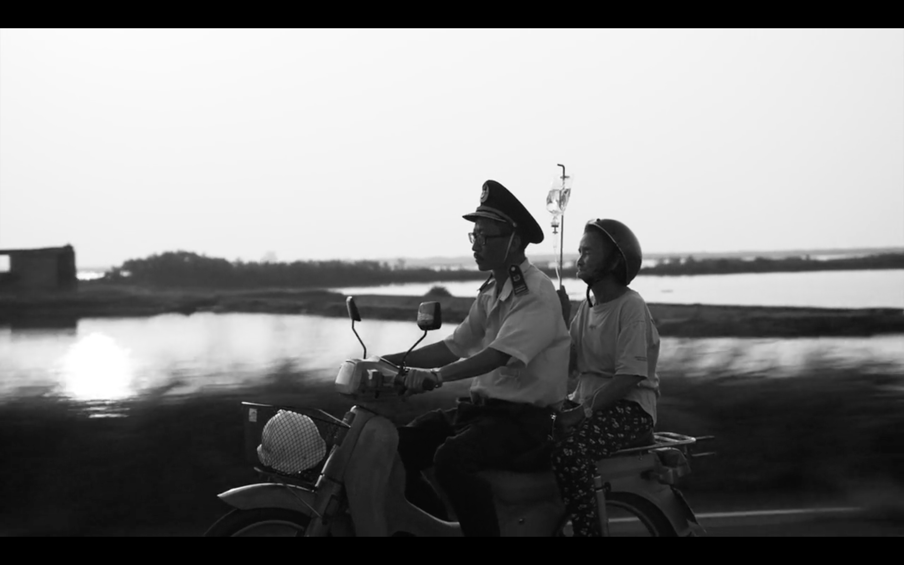
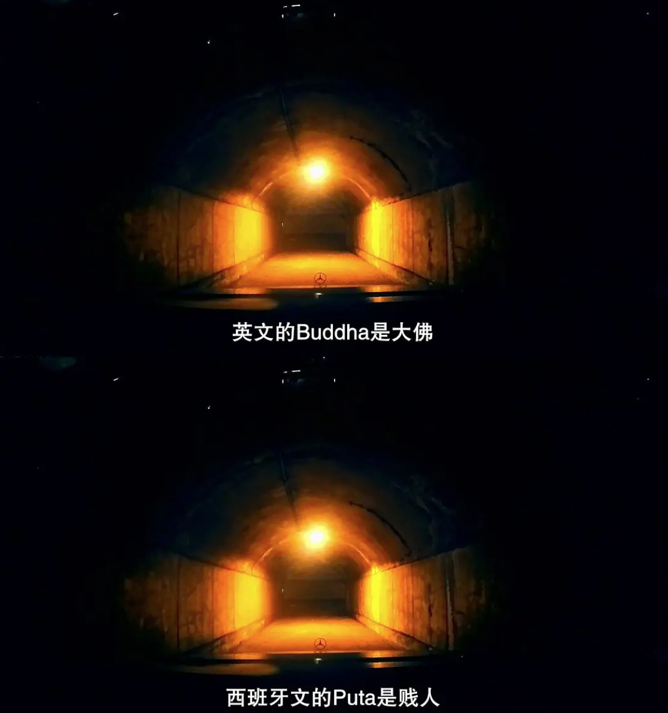
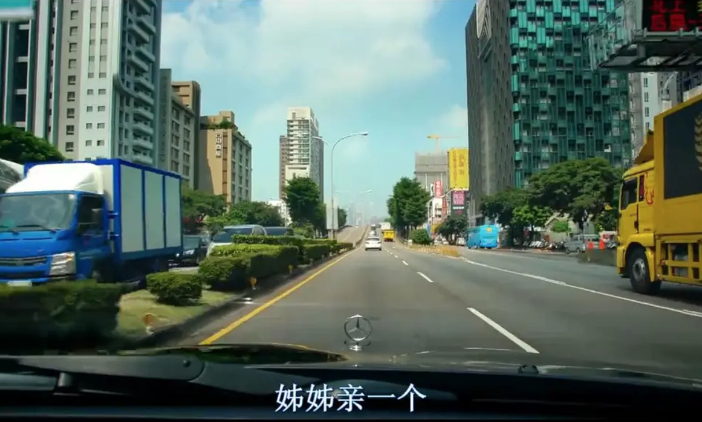
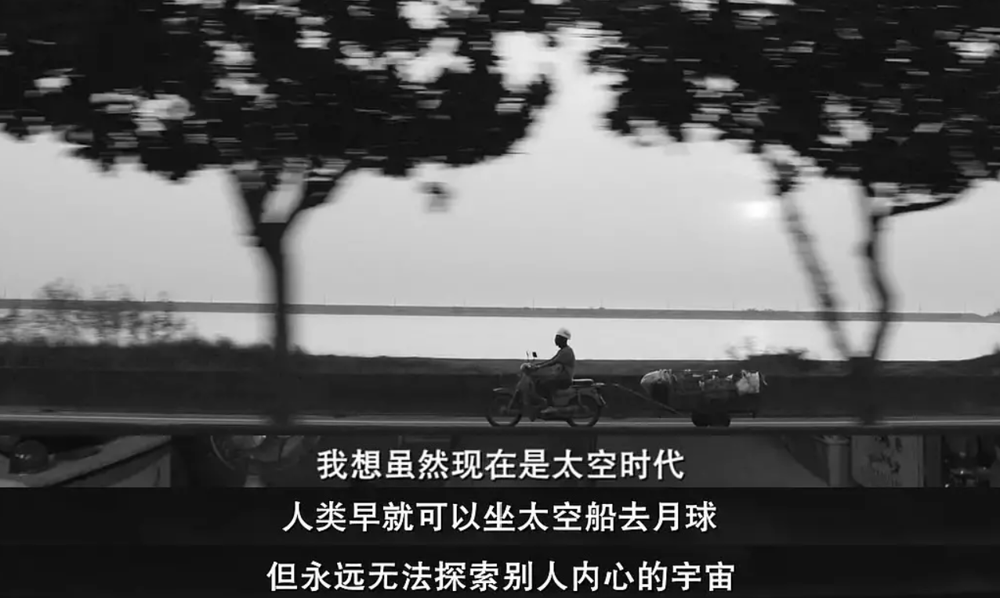
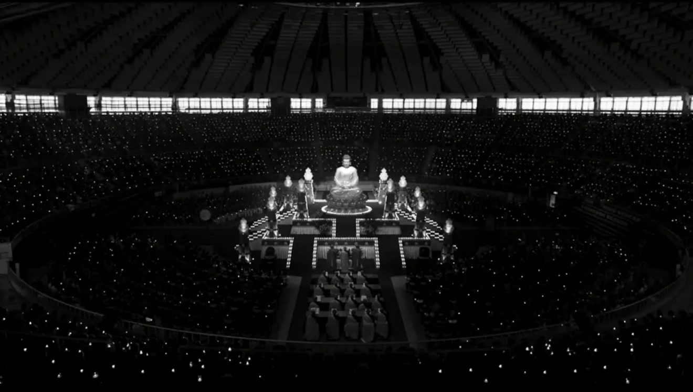

> 《大佛普拉斯》（英语：The Great Buddha+），由锺孟宏、叶如芬监制，黄信尧自编自导，并由庄益增、陈竹升、戴立忍、陈以文、纳豆、张少怀、丁国琳与雷婕熙主演。本片是由2014年黄信尧入围金马奖最佳短片的作品《大佛》发展而来，片名中的“普拉斯”为英文“加号”（plus）的音译，代表加长版或是加强版之意。2017年10月13日，于台北正式上映。
>
> 本片获选为2017年台北电影节开幕片[2]，也荣获电影节的百万首奖及剧情长片奖。本片于2017年荣获加拿大多伦多国际影展“亚洲影评人联盟奖”（NETPAC AWARD），也获邀参加温哥华影展，韩国釜山影展及日本东京影展，2018年3月入选纽约新导演新电影影展，同样也在2018年3月印度新德里举行的第2届Habitat国际电影节，观众的回响也很热烈，在各地的影展期间佳评如潮，掌声不断。2018年4月在香港，又夺得37届香港电影金像奖最佳两岸华语片。——*Wikipedia*

------------

这是一部有旁白的作品，画面未现就先有说故事的人开嗓了。声音是有趣的闽南语，个人感受是：三分靠描述，七分得意会。

电影开篇就是黑白的画面，当时第一反应还怀疑是不是下载的资源有问题，17年上映的电影怎么可能是黑白的？剧情往后一点才反应过来，原来是技术和艺术手段，有意为之的”灰“。

旁白的介绍

描绘现实的作品似乎都离不开钱、权、色，大佛plus也不例外。整部影片把镜头分别对准了两拨人：钱、权、色都唾手可得的一拨人；另一拨则是要啥没啥的人。两个极端，处于中间的也有镜头，比较深刻的就是虔诚参拜大佛的大多数。

释迦（左一），菜脯（中），肚财（右一）

释迦。配角之一，通篇只有一句台词：”随便逛一逛“。谜一般的存在。

肚财。主角之一，看起来让人觉得有点猥琐，但是却有个反差萌的爱好——夹娃娃。收破烂为生，人前畏畏缩缩，在朋友菜脯面前的才敢呼呼喝喝大声说话。

菜脯。主角之一，一个大孝子，在人前似乎永远都是唯唯诺诺，即便是在朋友面前也一样低声下气，不像肚财。在佛像工厂当看更，还兼职殡葬乐队的鼓手。

隧道里面的片段，画面和对白……很激情。

也不是通篇都是黑白的，起码行车记录仪的镜头都是彩色。

导演真是个人才，竟然想到通过行车记录仪这一招去展示黄老板这些大人物的酒池玉林和纸醉金迷，简直不能太真实。

菜脯去了肚财家里缅怀，回去的路上出现的一段旁白。

别人内心的宇宙永远无法探索。很早之前就认可的一个道理，我们的成语中也早早就有了”人心叵测“这样一种描述，而且先不说探索别人的内心宇宙，就是自己的内心宇宙又有多少人已经或者可以探索清楚呢。

但是人这种动物有个顽固且强烈的癖好，就是非常好奇别人的生活。肚财和菜脯因为想要并且窥探了大老板的生活，看了一个又一个行车记录仪的视频，意外地发现了可怕的秘密，最终惹祸上身。

两个人平静的生活从此被打破，肚财已经不敢去工厂找菜脯一起看小黄书和吃宵夜了，只敢在门口无言的站着。知道自己摊上了事，想要求助却无门。去求神，却发现原来神也挑人。

怀着恐惧不安的心继续生活，破烂还是要继续收，工厂的守夜还是要继续干。

菜脯首先想到的还是如何安顿好他的老母，找到唯一一个小叔，结果全程没有机会说话，还被讹了300块钱。

最后，肚财在阿姨那里吃了顿饭，还有个大鸡腿，就不辞而别了。

大佛铸成后，众人参拜金身大佛。大佛表面上金光闪闪让人心生崇敬，实际上内里藏污纳垢。藏着什么？自己去看吧~