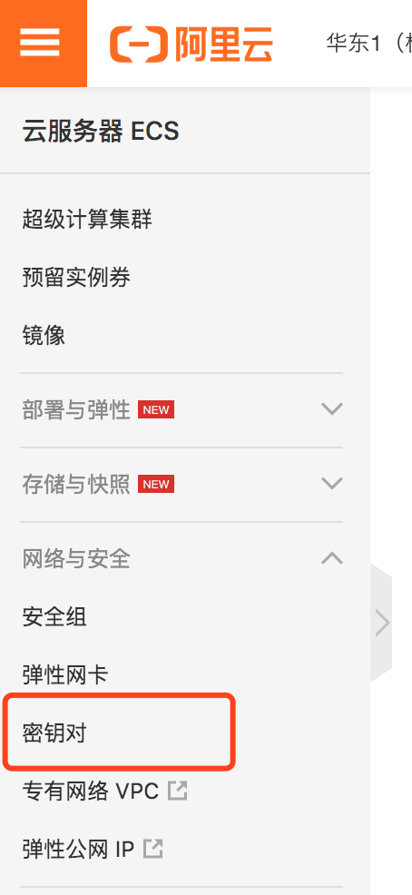
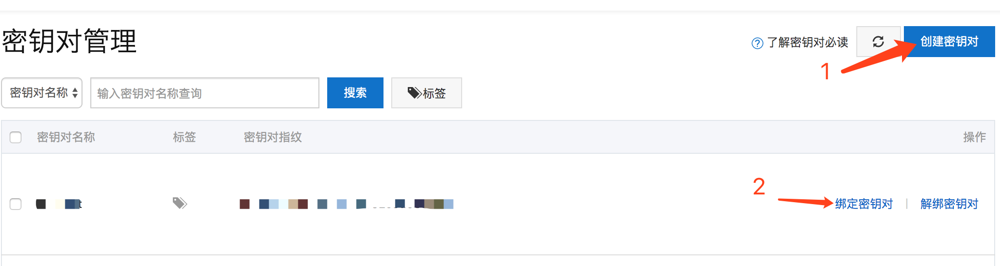

## 操作步骤

1. 登录ECS管理控制台。

2. 在左侧导航栏，单击网络与安全 > 密钥对。
     

3. 在顶部状态栏左上角处，选择地域。

4. 单击创建密钥对。

5. 设置密钥对名称，点击确定会创建密钥并自动下载。

    

6. 打开Mac 的terminal窗口

    1.  cd ~/.ssh 进入到.ssh目录下
    2.  `mv ~/Documents/ssh/aipetpet.pem ./ `把密钥移动或复制到当前.ssh目录下
    3.  修改密钥文件的权限`chmod 400 aipetpet.pem`

7. 连接至实例

    `ssh -i ~/.ssh/mysshkey.pem root@10.10.xx.xxx`

8. 输入实例登录密码，登录成功

9. 配置使用别名连接服务器

